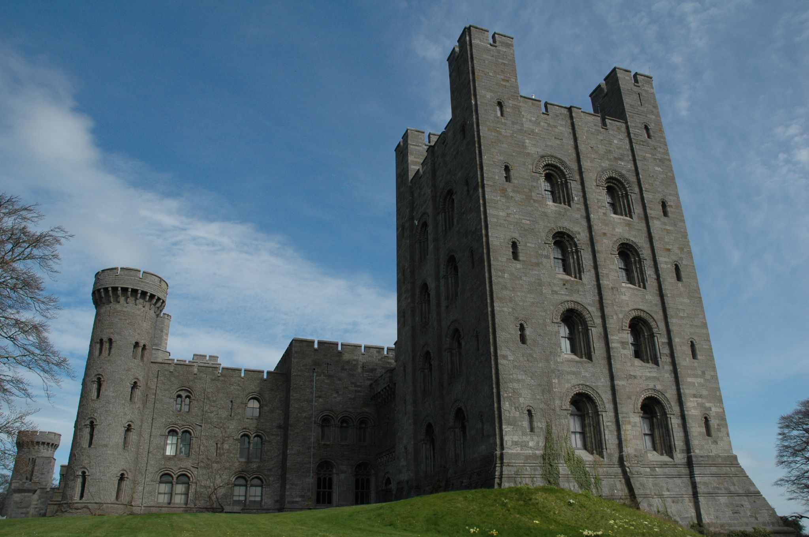
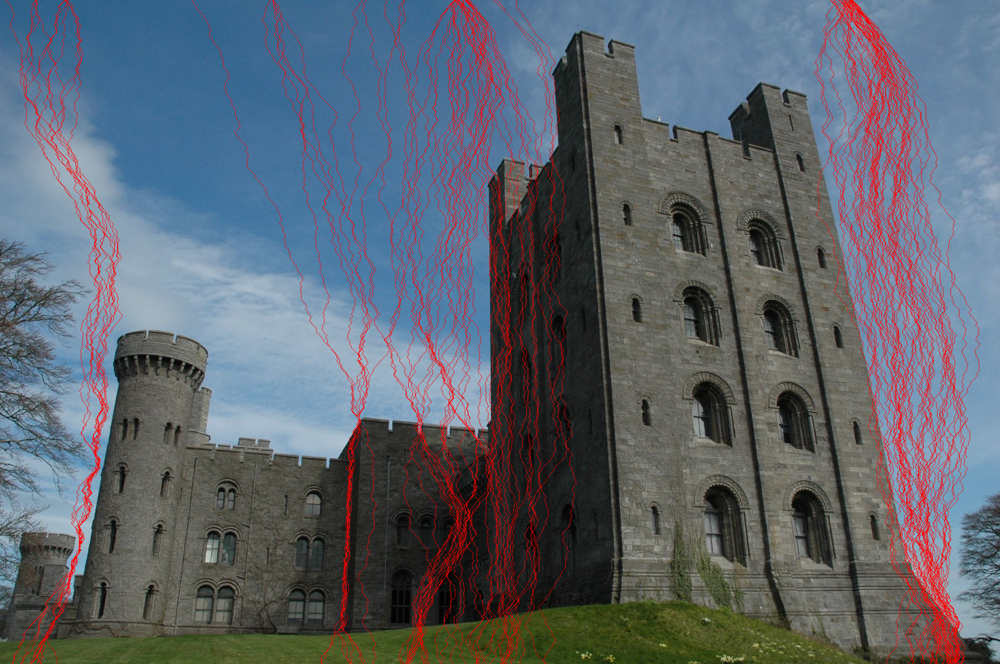
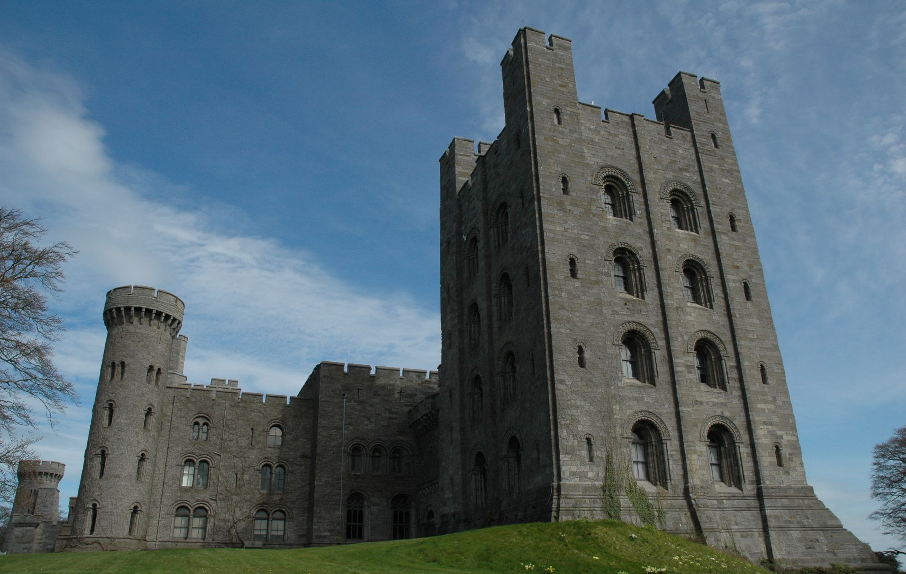

# red-mountain-resize
An image resize tool utilizing seam carving.

### Roadmap
- [x] Energy grid calculation
- [x] Image Reduction
- [x] UX finalized
- [x] Image Enlargement
- [x] Reduction/Enlargement in both directions
- [ ] Investigate multithreading options via Rayon.

### Example

Original:

Seams selected:

100 seams removed:

100 seams added:

