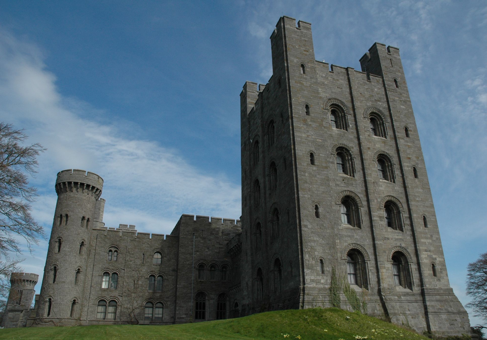

# red-mountain-resize
An image resize tool utilizing seam carving.

### Roadmap
- [x] Energy grid calculation
- [x] Image Reduction
- [ ] UX finalized
- [ ] Image Enlargement
- [ ] Reduction/Enlargement in both directions
- [ ] Investigate multithreading options via Rayon.

### Example

Before:

100 seams removed:

After:

